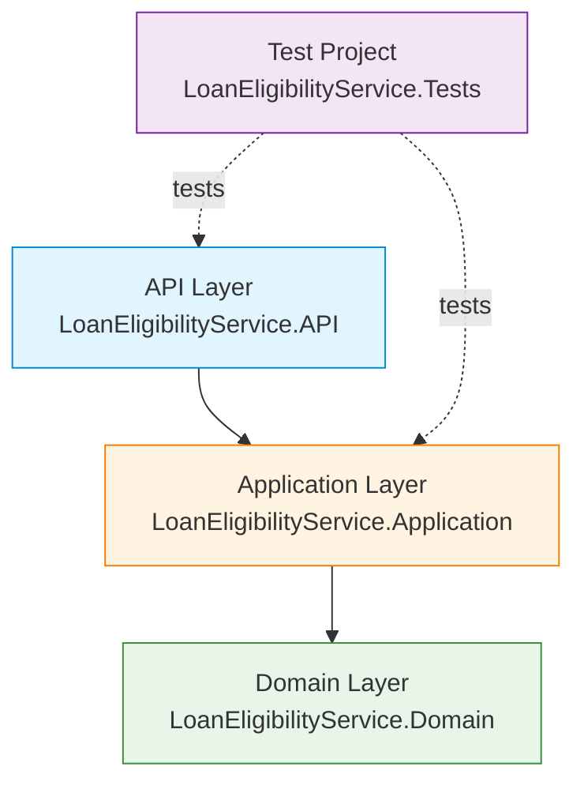

# Loan Eligibility Service

[](https://dotnet.microsoft.com/)
[](https://docs.microsoft.com/en-us/dotnet/csharp/)
[](LICENSE)
[](#testing)

A RESTful ASP.NET Core Web API that evaluates loan applications against defined business rules and returns eligibility decisions with detailed reasoning.

---

## Table of Contents

- [Overview](#overview)
- [Features](#features)
- [Architecture](#architecture)
- [Getting Started](#getting-started)
- [API Reference](#api-reference)
- [Configuration](#configuration)
- [Testing](#testing)
- [External Dependencies](#external-dependencies)
- [Infrastructure](#infrastructure)
- [License](#license)

---

## Overview

The Loan Eligibility Service is a self-contained ASP.NET Core Web API that automates the initial screening of loan applications. It accepts applicant details, evaluates them against a defined set of business rules, and returns a clear eligibility decision together with the specific reasons for any rejection.

**Key capabilities:**

- Validates applicant data (age, credit score, monthly income, loan amount) against configurable business rules
- Returns structured responses indicating eligibility status and reasons for ineligibility
- Exposes a single, well-documented REST endpoint consumable by any client
- Provides interactive API documentation via Swagger UI in development mode
- Fully unit-tested with 18 tests covering both the service layer and controller layer

**Target users/systems:**

- Front-end loan application portals
- Internal banking or fintech back-office systems
- Third-party integrations requiring automated pre-screening decisions

**Technical approach:**

The service follows Clean Architecture principles, separating domain models, business logic, and API concerns into distinct projects. There are no external service or database dependencies — eligibility evaluation is performed entirely in memory, making the service lightweight and easy to deploy.

---

## Features

- ✅ **Loan eligibility evaluation** — Assess applicants against multi-criteria business rules
- ✅ **Detailed rejection reasons** — Responses include a list of every failed criterion
- ✅ **RESTful API** — Single `POST` endpoint with JSON request/response
- ✅ **Input validation** — Returns `400 Bad Request` for missing or invalid input
- ✅ **Swagger / OpenAPI** — Interactive documentation available in development
- ✅ **Structured logging** — Uses ASP.NET Core's built-in `ILogger<T>`
- ✅ **Clean Architecture** — Domain, Application, and API layers are clearly separated
- ✅ **Unit tested** — 18 tests across service and controller layers

### Business Rules

| Rule | Requirement |
|------|-------------|
| Minimum age | 18 years |
| Minimum credit score | 600 |
| Minimum monthly income | $2,000 |
| Maximum loan amount | 10× monthly income |

All rules are evaluated independently; all failures are returned in the response so applicants receive complete feedback in a single request.

---

## Architecture

### Clean Architecture Layers



**Domain Layer** (`LoanEligibilityService.Domain`)
- Core business entities and domain models
- `LoanRequest` model representing the applicant's data
- No external dependencies — pure C# classes

**Application Layer** (`LoanEligibilityService.Application`)
- Business logic for evaluating eligibility rules
- `LoanEligibilityService` — implements `ILoanEligibilityService`
- `LoanEligibilityRequest` / `LoanEligibilityResponse` DTOs
- `ILoanEligibilityService` interface for dependency inversion
- Depends on: Domain

**API Layer** (`LoanEligibilityService.API`)
- ASP.NET Core Web API host
- `LoanEligibilityController` — exposes the `POST /api/loaneligibility/check` endpoint
- Swagger / OpenAPI configuration
- Depends on: Application, Domain

### Project Structure

```
loan-eligibility/
├── src/
│   ├── LoanEligibilityService.API/
│   │   ├── Controllers/
│   │   │   └── LoanEligibilityController.cs
│   │   └── Program.cs
│   ├── LoanEligibilityService.Application/
│   │   ├── DTOs/
│   │   │   ├── LoanEligibilityRequest.cs
│   │   │   └── LoanEligibilityResponse.cs
│   │   ├── Interfaces/
│   │   │   └── ILoanEligibilityService.cs
│   │   └── Services/
│   │       └── LoanEligibilityService.cs
│   └── LoanEligibilityService.Domain/
│       └── Models/
│           └── LoanRequest.cs
└── test/
    └── LoanEligibilityService.Tests/
        ├── API/
        │   └── Controllers/
        │       └── LoanEligibilityControllerTests.cs   (8 tests)
        └── Application/
            └── Services/
                └── LoanEligibilityServiceTests.cs      (10 tests)
```

### Technology Stack

| Component | Technology |
|-----------|-----------|
| Runtime | .NET 8 |
| Language | C# 12.0 |
| Web framework | ASP.NET Core Web API |
| API documentation | Swagger / OpenAPI (Swashbuckle) |
| Testing framework | xUnit 2.6.2 |
| Mocking | Moq 4.20.72 |
| Assertions | FluentAssertions 6.12.2 |
| Coverage | coverlet.collector 6.0.0 |

---

## Getting Started

### Prerequisites

- [.NET 8 SDK](https://dotnet.microsoft.com/download/dotnet/8.0) (8.0 or later)
- [Visual Studio 2022](https://visualstudio.microsoft.com/) or [Visual Studio Code](https://code.visualstudio.com/) with the C# extension
- [Git](https://git-scm.com/)

### Installation

1. **Clone the repository**

   ```bash
   git clone https://github.com/yourusername/loan-eligibility.git
   cd loan-eligibility
   ```

2. **Restore dependencies**

   ```bash
   dotnet restore
   ```

3. **Build the solution**

   ```bash
   dotnet build
   ```

4. **Run the API**

   ```bash
   dotnet run --project src/LoanEligibilityService.API
   ```

5. **Access Swagger UI**

   Once the API is running in development mode, open your browser and navigate to:

   ```
   https://localhost:<port>/swagger
   ```

   The exact port is printed to the console when the application starts.

---

## API Reference

### Endpoint

| Method | Path | Description |
|--------|------|-------------|
| `POST` | `/api/loaneligibility/check` | Evaluate a loan application for eligibility |

### Request Body — `LoanEligibilityRequest`

| Field | Type | Required | Description |
|-------|------|----------|-------------|
| `applicantId` | `string` | ✅ | Unique identifier for the applicant |
| `applicantName` | `string` | ✅ | Full name of the applicant |
| `age` | `integer` | ✅ | Age of the applicant in years |
| `creditScore` | `integer` | ✅ | Applicant's credit score |
| `monthlyIncome` | `decimal` | ✅ | Applicant's gross monthly income in USD |
| `loanAmount` | `decimal` | ✅ | Requested loan amount in USD |

### Response Body — `LoanEligibilityResponse`

| Field | Type | Description |
|-------|------|-------------|
| `isEligible` | `boolean` | `true` if the application meets all criteria |
| `reasons` | `string[]` | List of reasons the application was rejected (empty when eligible) |
| `message` | `string` | Human-readable summary of the eligibility decision |

### HTTP Status Codes

| Status | Condition |
|--------|-----------|
| `200 OK` | Request was processed successfully (check `isEligible` for the decision) |
| `400 Bad Request` | Request body is `null`, or `applicantId` / `applicantName` is missing or whitespace — response body is a plain string message |

### Examples

#### Eligible applicant

**Request**

```http
POST /api/loaneligibility/check
Content-Type: application/json

{
  "applicantId": "APP-001",
  "applicantName": "John Doe",
  "age": 30,
  "creditScore": 720,
  "monthlyIncome": 5000,
  "loanAmount": 40000
}
```

**Response — `200 OK`**

```json
{
  "isEligible": true,
  "reasons": [],
  "message": "Loan application is eligible for processing."
}
```

#### Ineligible applicant

**Request**

```http
POST /api/loaneligibility/check
Content-Type: application/json

{
  "applicantId": "APP-002",
  "applicantName": "Jane Smith",
  "age": 22,
  "creditScore": 540,
  "monthlyIncome": 1500,
  "loanAmount": 50000
}
```

**Response — `200 OK`**

```json
{
  "isEligible": false,
  "reasons": [
    "Credit score must be at least 600.",
    "Monthly income must be at least $2000.",
    "Loan amount cannot exceed 10 times the monthly income."
  ],
  "message": "Loan application does not meet eligibility criteria."
}
```

#### Missing required fields

**Request**

```http
POST /api/loaneligibility/check
Content-Type: application/json

{
  "age": 25,
  "creditScore": 700,
  "monthlyIncome": 3000,
  "loanAmount": 15000
}
```

**Response — `400 Bad Request`**

```
"ApplicantId and ApplicantName are required."
```

> **Note:** The controller returns a plain string body for `400 Bad Request` responses. A `null` request body returns `"Request cannot be null."` instead.

---

## Configuration

### appsettings.json

```json
{
  "Logging": {
    "LogLevel": {
      "Default": "Information",
      "Microsoft.AspNetCore": "Warning"
    }
  },
  "AllowedHosts": "*"
}
```

### appsettings.Development.json

In development mode, Swagger UI is automatically enabled and the application may use more verbose logging.

```json
{
  "Logging": {
    "LogLevel": {
      "Default": "Information",
      "Microsoft.AspNetCore": "Warning"
    }
  }
}
```

### Environment Variables

| Variable | Default | Description |
|----------|---------|-------------|
| `ASPNETCORE_ENVIRONMENT` | `Production` | Set to `Development` to enable Swagger UI |
| `ASPNETCORE_URLS` | `https://+:443;http://+:80` | Binding URLs for the API host |

To run in development mode locally:

```bash
ASPNETCORE_ENVIRONMENT=Development dotnet run --project src/LoanEligibilityService.API
```

---

## Testing

### Running Tests

Run the full test suite from the repository root:

```bash
dotnet test test/LoanEligibilityService.Tests/
```

Run tests with detailed output:

```bash
dotnet test test/LoanEligibilityService.Tests/ --logger "console;verbosity=detailed"
```

Run tests with code coverage:

```bash
dotnet test test/LoanEligibilityService.Tests/ --collect:"XPlat Code Coverage"
```

### Test Structure

| Test File | Tests | Coverage Area |
|-----------|-------|---------------|
| `LoanEligibilityServiceTests.cs` | 10 | Application service — business rule validation |
| `LoanEligibilityControllerTests.cs` | 8 | API controller — HTTP responses, input validation |
| **Total** | **18** | |

#### Service Tests (`LoanEligibilityServiceTests.cs`)

Covers scenarios including:

- Eligible applicant meeting all criteria
- Applicant below minimum age (< 18)
- Applicant with insufficient credit score (< 600)
- Applicant with insufficient monthly income (< $2,000)
- Loan amount exceeding 10× monthly income
- Multiple simultaneous rule failures
- Boundary / edge-case values

#### Controller Tests (`LoanEligibilityControllerTests.cs`)

Covers scenarios including:

- Returns `200 OK` with eligible response
- Returns `200 OK` with ineligible response
- Returns `400 Bad Request` for null request body
- Returns `400 Bad Request` for missing `ApplicantId`
- Returns `400 Bad Request` for missing `ApplicantName`
- Verifies the service is called with the correct arguments
- Verifies response structure matches expected DTOs

### Test Dependencies

| Package | Version | Purpose |
|---------|---------|---------|
| xUnit | 2.6.2 | Unit testing framework |
| Moq | 4.20.72 | Mocking `ILoanEligibilityService` in controller tests |
| FluentAssertions | 6.12.2 | Readable assertion syntax |
| coverlet.collector | 6.0.0 | Code coverage collection |

---

## External Dependencies

### Runtime Dependencies

| Package | Version | Purpose |
|---------|---------|---------|
| `Microsoft.AspNetCore.OpenApi` | 8.0.x | OpenAPI metadata support |
| `Swashbuckle.AspNetCore` | 6.x | Swagger UI and OpenAPI document generation |

### Development / Test Dependencies

| Package | Version | Purpose |
|---------|---------|---------|
| `xunit` | 2.6.2 | Unit testing framework |
| `xunit.runner.visualstudio` | 2.6.2 | Test runner integration for Visual Studio and `dotnet test` |
| `Moq` | 4.20.72 | Mock object framework |
| `FluentAssertions` | 6.12.2 | Fluent assertion library |
| `coverlet.collector` | 6.0.0 | Cross-platform code coverage |
| `Microsoft.NET.Test.Sdk` | Latest | .NET test SDK |

### No External Service Dependencies

This service is currently **self-contained** with no external API, database, or messaging dependencies. All eligibility logic runs in-process.

**Future considerations:**

- Database integration for persisting application history (SQL Server, PostgreSQL)
- Credit bureau API integration for real-time credit score lookups
- Identity / authentication service (e.g., Azure AD, OAuth 2.0)
- Log aggregation (Application Insights, Seq, ELK stack)
- Message broker integration for async decision notifications (Azure Service Bus, RabbitMQ)

---

## Infrastructure

### Current Infrastructure

| Concern | Detail |
|---------|--------|
| Hosting | Self-hosted / IIS / Azure App Service |
| Platform | .NET 8 Runtime |
| Protocol | HTTP / HTTPS |
| API Documentation | Swagger UI (development only) |
| Logging | ASP.NET Core structured logging via `ILogger<T>` |

### Deployment

#### Local Development

```bash
ASPNETCORE_ENVIRONMENT=Development dotnet run --project src/LoanEligibilityService.API
```

#### Publish a Self-Contained Binary

```bash
dotnet publish src/LoanEligibilityService.API \
  --configuration Release \
  --runtime linux-x64 \
  --self-contained true \
  --output ./publish
```

#### Docker (Example)

```dockerfile
FROM mcr.microsoft.com/dotnet/aspnet:8.0 AS base
WORKDIR /app
EXPOSE 80
EXPOSE 443

FROM mcr.microsoft.com/dotnet/sdk:8.0 AS build
WORKDIR /src
COPY . .
RUN dotnet publish src/LoanEligibilityService.API -c Release -o /app/publish

FROM base AS final
WORKDIR /app
COPY --from=build /app/publish .
ENTRYPOINT ["dotnet", "LoanEligibilityService.API.dll"]
```

#### Azure App Service (Recommended Cloud Target)

| Setting | Value |
|---------|-------|
| App Service Plan | B1 or higher |
| Runtime Stack | .NET 8 |
| Always On | Enabled |
| HTTPS Only | Enabled |
| `ASPNETCORE_ENVIRONMENT` | `Production` |

### Monitoring & Logging

- Structured logging via `ILogger<T>` at `Information`, `Warning`, and `Error` levels
- Log output to console by default
- **Future:** Application Insights or Seq integration for centralised log aggregation and alerting

### Security

- HTTPS enforced for all traffic
- Input validation on all request fields
- No secrets stored in source code
- **Future:** Authentication and authorization (JWT / OAuth 2.0)
- **Future:** Rate limiting to prevent abuse

---

## License

This project is licensed under the MIT License — see the [LICENSE](LICENSE) file for details.
